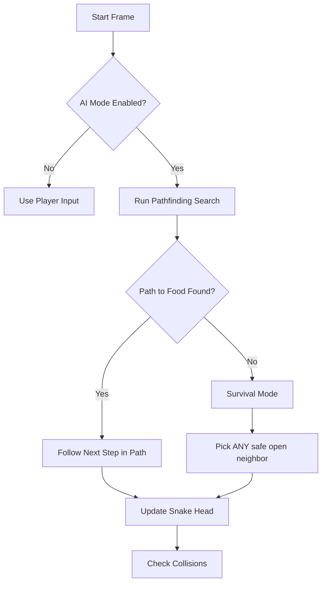
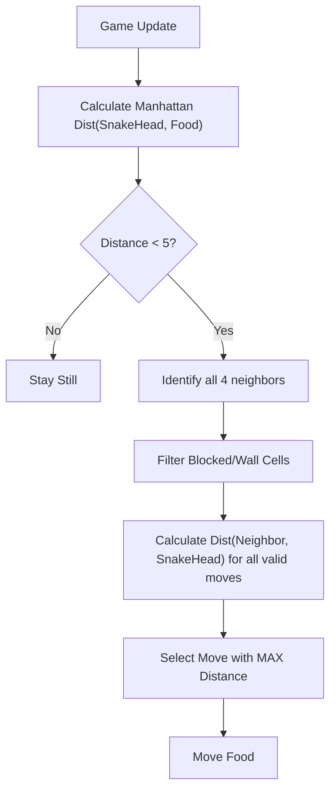
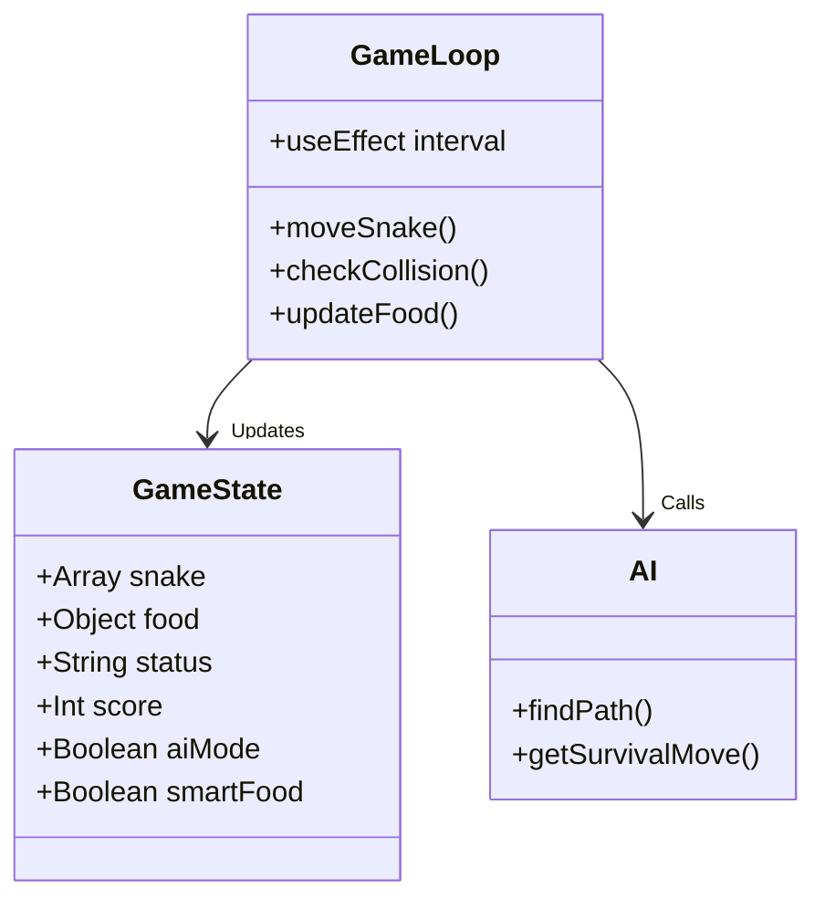

# Neon Snake AI - Implementation Guide

This guide details the technical implementation of the AI algorithms and game logic used in Neon Snake AI.

## 🧠 AI Pathfinding Logic (The Snake)

The core of the "Autopilot" feature is a shortest-path algorithm that recalculates the optimal path to the food on every single frame.

### Algorithm: Pathfinding (Shortest Path)
We use a shortest-path algorithm because the grid is unweighted (moving to any neighbor costs 1 step), effectively guaranteeing the shortest path.

#### Flowchart

### Implementation Details (`src/utils/aiLogic.js`)
1. **Queue Initialization**: `[[start_node]]`
2. **Visited Set**: Tracks coordinates `x,y` to prevent cycles.
3. **Exploration**:
   - Dequeue current path.
   - Check all 4 neighbors (Up, Down, Left, Right).
   - If neighbor is **Food**: Return path.
   - If neighbor is **Safe** (not wall, not body) and **Unvisited**: Add to queue.
4. **Fallback (Survival Mode)**: If the snake traps itself or cannot reach the food, it picks any available open neighbor to stall for time, hoping a path opens up as the tail moves.

---

## 🍎 Smart Food Evasion Logic

To make the game challenging, the food is not a static target. It possesses a basic "instinct" to run away when threatened.

### Evasion Decision Tree

### Logic (`getFoodEvasionMove`)
1. **Danger Radius**: The food only reacts if the snake is within **5 tiles** (Manhattan Distance).
2. **Move Evaluation**:
   - It simulates moving to all available adjacent cells.
   - For each cell, it calculates how far that cell is from the snake's head.
3. **Selection**: It greedily chooses the cell that maximizes the distance from the threat.

---

## 🎮 Game Loop & State Management

The game uses a React custom hook (`useGameLogic`) to manage the state and game loop.

### State Architecture

### Key Components
- **`App.jsx`**: Main container, handles HUD rendering, input listeners, and passes state to the canvas.
- **`components/GameCanvas.jsx`**: Pure presentation component. Receives `snake`, `food`, and `aiPath` props and renders them to an HTML5 Canvas using standard 2D context methods.
- **`hooks/useGameLogic.js`**: "Brain" of the application. Contains the `setInterval` loop that drives the game physics 10-15 times per second.

